# FPGA-Based Edge-AI Vision Accelerator
### Detailed Design Specification
**IEEE SSCS Egypt Chapter 2026 Student Design Competition**

> **Editor's note on this revision:** The source document numbered itself as "18 Parts," but Part 18 actually contained a duplicate re-specification of `global_ctrl.sv` (already fully specified in Part 7) plus a duplicate re-specification of `dut_top.sv` (already fully specified in Part 6), followed by the project's final closing summary. In this cleaned version, the duplicate FSM/interface content has been merged into Parts 6 and 7 (the more detailed originals), and the closing summary now lives in its own final section. No technical content was removed — only de-duplicated and reorganized.

---

## Table of Contents

1. [Introduction](#1-introduction)
2. [Competition Requirements & Functional Spec](#2-competition-requirements--functional-spec)
3. [High-Level Architecture](#3-high-level-architecture)
4. [Global Accelerator Operation](#4-global-accelerator-operation)
5. [Module Specification: `cfg.sv`](#5-module-specification-cfgsv)
6. [Module Specification: `dut_top.sv`](#6-module-specification-dut_topsv)
7. [Module Specification: `global_ctrl.sv`](#7-module-specification-global_ctrlsv)
8. [Module Specification: `input_if.sv`](#8-module-specification-input_ifsv)
9. [Module Specification: `input_ctrl.sv`](#9-module-specification-input_ctrlsv)
10. [Module Specification: `kernel_mem.sv`](#10-module-specification-kernel_memsv)
11. [Module Specification: `sliding_window.sv`](#11-module-specification-sliding_windowsv)
12. [Module Specification: `processing_element.sv`](#12-module-specification-processing_elementsv)
13. [Module Specification: `MAC_array.sv`](#13-module-specification-mac_arraysv)
14. [Module Specification: `accumulator.sv`](#14-module-specification-accumulatorsv)
15. [Module Specification: `relu.sv`](#15-module-specification-relusv)
16. [Module Specification: `output_formatter.sv`](#16-module-specification-output_formattersv)
17. [Module Specification: `output_ctrl.sv`](#17-module-specification-output_ctrlsv)
18. [Final Frozen File List & Summary](#18-final-frozen-file-list--summary)

---

## 1. Introduction

### 1.1 Purpose

This document defines the complete architecture and RTL implementation specification of the FPGA-Based Edge-AI Vision Accelerator.

The competition specification describes **what** the accelerator must accomplish; this document describes **how** it shall be implemented. It is the single source of truth for the team throughout the project. Every RTL module, interface, parameter, controller, memory block, and datapath described here is the official implementation reference — no architectural decision should be made during coding unless this document is updated first.

### 1.2 Document Objectives

- Define the complete accelerator architecture before RTL implementation
- Freeze all major architectural decisions
- Eliminate ambiguity between team members
- Define every module's responsibilities and interfaces
- Define dataflow and the interaction between datapath and control path
- Reduce integration issues and simplify verification planning

### 1.3 Scope

Covers: global controller, configuration registers, input interface, input controller, kernel memory, sliding-window subsystem, processing elements, MAC array, accumulator, ReLU, output formatter, output controller, output memory, and top-level integration.

Verification methodology is discussed only at the architectural level — the full verification plan lives in a separate document.

### 1.4 Design Philosophy

| Principle | Description | Benefit |
|---|---|---|
| **Streaming architecture** | Pixels are processed as they arrive; the entire image is never buffered | Lower latency, better throughput, reduced memory, better FPGA utilization |
| **Modular design** | Every block owns exactly one responsibility and talks to others only through defined interfaces | Readability, verification, debugging, scalability, reuse |
| **Parameterized RTL** | Anything that changes hardware structure (e.g. kernel size `N`) is a compile-time parameter; anything that only changes behavior (image size, kernel values, ReLU enable...) is a runtime register | Clean separation of "what requires resynthesis" vs. "what's configurable" |
| **Resource-aware design** | Every decision is weighed against its effect on LUT/DSP/BRAM utilization and power, since the competition Figure of Merit penalizes resource usage heavily | High FoM |

### 1.5 Accelerator Overview

The accelerator performs programmable 2D convolution on a single-channel grayscale image or feature map:


A centralized **Global Controller** coordinates every stage.

### 1.6 Target FPGA

- RTL shall remain FPGA-vendor independent whenever possible
- No vendor-specific IP unless required by synthesis/implementation
- Arithmetic shall infer DSP blocks automatically; memories shall infer Block RAM whenever appropriate

### 1.7 Naming Conventions

| Item | Convention | Example |
|---|---|---|
| Modules | `snake_case` | `global_ctrl.sv` |
| Parameters | `UPPER_CASE` | `parameter N = 5` |
| Local parameters | `UPPER_CASE` | `localparam IDLE = 0` |
| Signals | `snake_case` | `window_valid` |
| Registers | `snake_case` | `pixel_counter` |
| FSM states | `UPPER_CASE` | `PROCESSING` |
| Constants | `UPPER_CASE` | `MAX_PIXEL_VALUE` |

### 1.8 Frozen Architectural Decisions

| ID | Decision |
|---|---|
| AD-001 | Streaming architecture — entire input images are **never** fully buffered |
| AD-002 | Image dimensions are runtime-configurable via config registers |
| AD-003 | Kernel coefficients are runtime-programmable via Kernel Memory |
| AD-004 | Kernel dimension `N` is a compile-time RTL parameter (`parameter int N = 5;`) |
| AD-005 | Single-channel grayscale images only |
| AD-006 | Input pixels: 8-bit **unsigned** integer |
| AD-007 | Kernel coefficients: 8-bit **signed** integer |
| AD-008 | Stride fixed to 1 — no runtime or compile-time stride configuration |
| AD-009 | ReLU is an optional hardware block, gated by a config register |
| AD-010 | Output Formatter supports configurable shift, optional rounding, and saturation before producing the final 16-bit signed output |

---

## 2. Competition Requirements & Functional Spec

This chapter translates the official competition requirements into frozen implementation decisions.

| Req ID | Requirement | Implementation Decision |
|---|---|---|
| **FR-001** | Input image | Grayscale only, 1 channel. RGB / multi-channel out of scope. |
| **FR-002** | Image dimensions ≥ 32×32 | Runtime-programmable via `IMG_WIDTH` / `IMG_HEIGHT` registers, written before `START` |
| **FR-003** | Input pixel type | Unsigned 8-bit, `U8.0`, range 0–255 |
| **FR-004** | Kernel size N×N | Compile-time parameter `N` (e.g. `parameter int N = 5;`); changing `N` requires resynthesis |
| **FR-005** | Kernel coefficients programmable | Stored in `kernel_mem.sv`, loaded before processing; never modified internally |
| **FR-006** | Kernel precision | Signed 8-bit, `S8.0`, range −128 … +127 |
| **FR-007** | Stride | Fixed to 1, not configurable |
| **FR-008** | Output precision | Signed, minimum 16 bits (internal computation may exceed 16 bits) |
| **FR-009** | ReLU (optional per competition) | Implemented, gated by a config register. Disabled → `out = in`. Enabled → `out = max(0, in)` |
| **FR-010** | Verification | Hardware compared automatically against a **Python** golden model; expected output must exactly match RTL output |
| **FR-011** | FPGA implementation | Must report LUT/FF/DSP/BRAM utilization, max frequency, timing status, estimated power |
| **FR-012** | Figure of Merit | `FoM = Throughput / (Power × (LUT + 50·DSP + 100·BRAM))`, Throughput in output pixels/clock |

### Design Goals

| Primary | Secondary |
|---|---|
| Functional correctness | Readable RTL |
| Modular architecture | Easy verification & debugging |
| Clean, parameterized RTL | Vendor-independent implementation |
| Low FPGA resource utilization | Future extensibility |
| High Figure of Merit | |

### Design Constraints

- **C-001** Streaming architecture — no full-image buffering
- **C-002** One responsibility per module
- **C-003** Compile-time params only when they change hardware structure; runtime registers only configure execution
- **C-004** Arithmetic shall infer DSP blocks — no vendor multiplier IP unless required
- **C-005** Memories shall infer BRAM whenever appropriate

### System-Level Processing Sequence

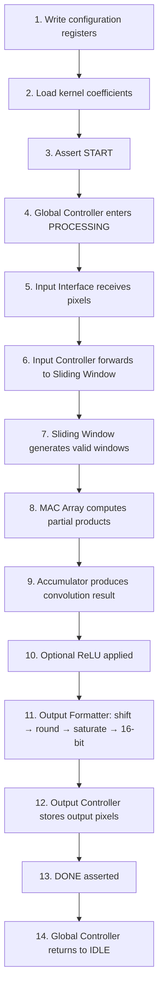

---

## 3. High-Level Architecture

### 3.1 Top-Level Subsystems

The accelerator consists of three cooperating subsystems: **Control Path**, **Data Path**, and **Configuration Path**.

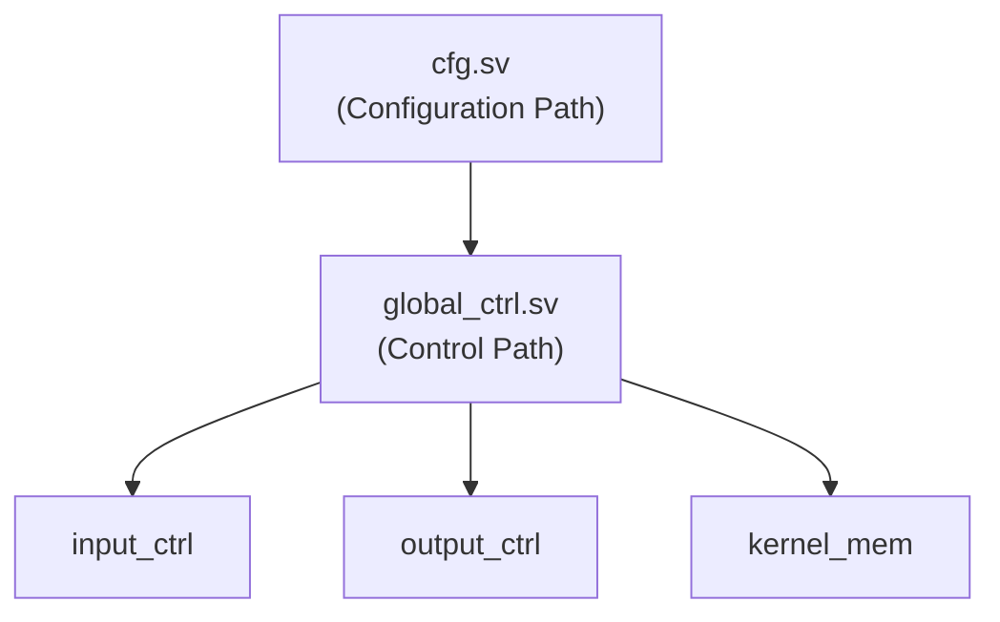

### 3.2 Data Path

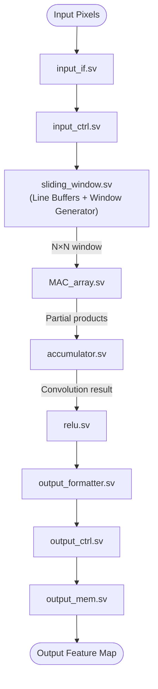

### 3.3 Control Path

The Global Controller is the **only** module allowed to control accelerator execution. Commands/status flow through it; no datapath module may autonomously start or stop the accelerator.

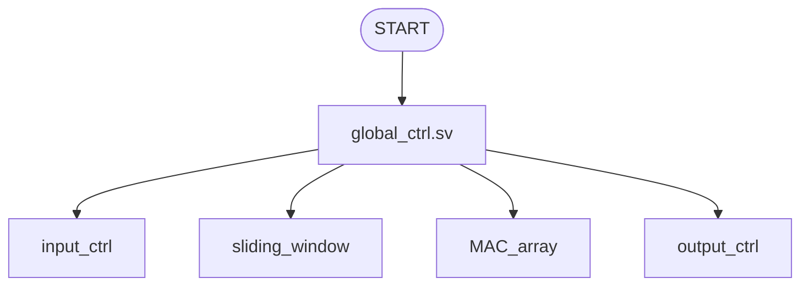

### 3.4 Configuration Path

Configuration registers are written **before** `START` and remain constant during processing — changing configuration while busy is not supported.

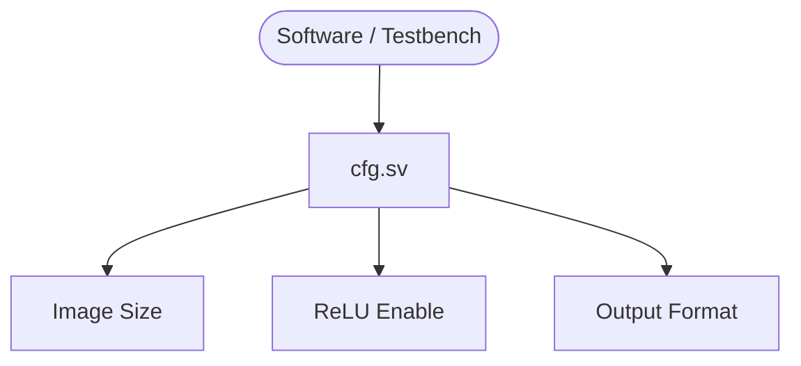

### 3.5 Module List

| Module | Category | Purpose |
|---|---|---|
| `dut_top.sv` | Top-Level | Integrates the entire accelerator |
| `cfg.sv` | Configuration | Stores runtime configuration registers |
| `global_ctrl.sv` | Controller | Controls accelerator execution |
| `input_if.sv` | Interface | Receives external image data |
| `input_ctrl.sv` | Controller | Controls pixel flow |
| `kernel_mem.sv` | Memory | Stores programmable kernel coefficients |
| `sliding_window.sv` | Datapath | Generates N×N windows |
| `processing_element.sv` | Datapath | One signed multiplication |
| `MAC_array.sv` | Datapath | Row partial products |
| `accumulator.sv` | Datapath | Accumulates partial sums |
| `relu.sv` | Datapath | Optional activation function |
| `output_formatter.sv` | Datapath | Shift, rounding, saturation, width conversion |
| `output_ctrl.sv` | Controller | Controls output generation |
| `output_mem.sv` | Memory | Stores output feature map |

Each module owns exactly **one** primary responsibility (see per-module chapters below) — no module assumes another's job.

### 3.6 Datapath Philosophy

The accelerator streams pixels continuously; entire images are never buffered. Only the minimum information needed to build the next sliding window is stored, minimizing BRAM usage, latency, and idle cycles while maximizing data reuse.

### 3.7 Parameterization Strategy

| Compile-time parameters (require resynthesis) | Runtime configuration (in `cfg.sv`) |
|---|---|
| Kernel dimension `N` | Image width, image height, kernel coefficients, ReLU enable, output formatter options |

### 3.8 Data Lifetime — who owns what

| Data | Owner Module |
|---|---|
| Input pixels | `input_if.sv` |
| Sliding window | `sliding_window.sv` |
| Kernel coefficients | `kernel_mem.sv` |
| Partial products | `MAC_array.sv` |
| Partial sum | `accumulator.sv` |
| Final pixel | `output_formatter.sv` |
| Output feature map | `output_mem.sv` |

No unnecessary copies of data are created anywhere in the pipeline.

### 3.9 Design Principles

1. One module, one responsibility
2. Streaming over batch processing
3. Parameterize hardware structure; configure execution at runtime
4. Minimize BRAM and DSP utilization while maintaining acceptable throughput
5. Keep module interfaces simple and well-defined
6. Prevent architectural coupling between independent modules

---

## 4. Global Accelerator Operation

### 4.1 Accelerator Life Cycle

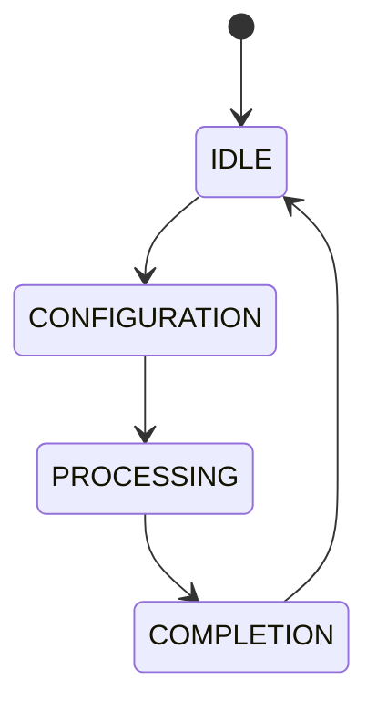

The accelerator always returns to **IDLE** after finishing one image.

### 4.2 Phase 1 — Configuration

Before asserting `START`, software (or testbench) configures the accelerator:

1. Write `IMG_WIDTH`
2. Write `IMG_HEIGHT`
3. Write ReLU configuration
4. Write Output Formatter configuration
5. Load all kernel coefficients
6. Assert `START`

During this phase, no image processing occurs; only `cfg.sv` and `kernel_mem.sv` are active.

### 4.3 Phase 2 — Processing

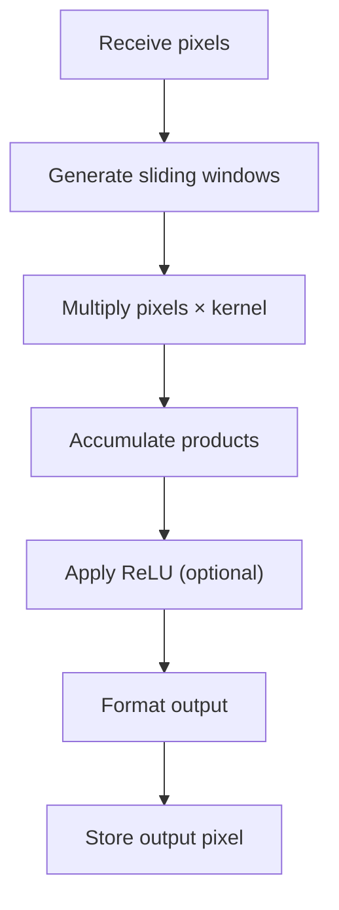

Repeats until the complete output feature map is generated.

### 4.4 Phase 3 — Completion

When the final output pixel is generated: Output Controller finishes writing → asserts `DONE` → Global Controller returns to `IDLE`, ready for a new `START`.

### 4.5 Global FSM

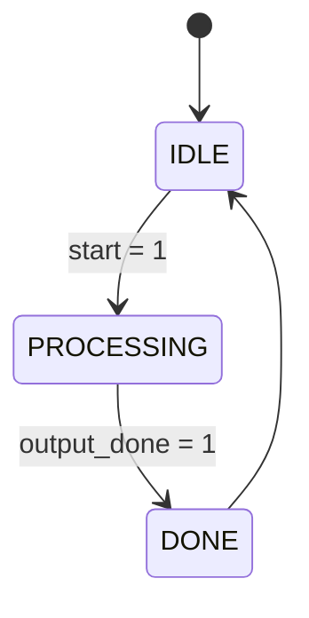

Only three states are required.

### 4.6 State Descriptions

| State | Purpose | Active Modules | Exit Condition |
|---|---|---|---|
| **IDLE** | Wait for a new execution request | `cfg.sv`, `kernel_mem.sv` only (all datapath modules idle) | `START == 1` |
| **PROCESSING** | Execute convolution over the complete image | `input_if`, `input_ctrl`, `sliding_window`, `MAC_array`, `accumulator`, `relu`, `output_formatter`, `output_ctrl`, `output_mem` | `DONE == 1` (from Output Controller) |
| **DONE** | Finalize execution, cleanly return to IDLE (no datapath computation here) | — | Immediate → IDLE |

### 4.7 Module Activation Timeline

| Module | IDLE | PROCESSING | DONE |
|---|:---:|:---:|:---:|
| cfg | ✓ | Read Only | Read Only |
| global_ctrl | ✓ | ✓ | ✓ |
| input_if | | ✓ | |
| input_ctrl | | ✓ | |
| kernel_mem | ✓ | Read Only | ✓ |
| sliding_window | | ✓ | |
| MAC_array | | ✓ | |
| accumulator | | ✓ | |
| relu | | ✓ | |
| output_formatter | | ✓ | |
| output_ctrl | | ✓ | |
| output_mem | | ✓ | |

### 4.8 Startup Latency

The accelerator cannot produce output immediately after `START` — the first valid window requires buffering the required image rows first:


Startup latency depends on image width and kernel size, so it is **not constant**.

### 4.9 Steady-State Operation

Once the first valid window exists:

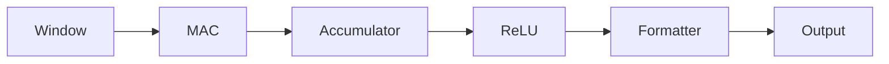

The datapath stays continuously active until the final output pixel.

### 4.10 Accelerator Restart

After `DONE`: status flags clear, controller returns to `IDLE`, **configuration and kernel memory are preserved**. A second execution can begin immediately on the next `START` — the kernel only needs reloading if different coefficients are desired.

### 4.11 Responsibilities of the Global Controller

| Shall | Shall NOT |
|---|---|
| Monitor `START` | Read image pixels |
| Start accelerator execution | Generate sliding windows |
| Enable processing | Perform arithmetic |
| Monitor completion | Access output memory directly |
| Return accelerator to IDLE | Modify kernel coefficients |

Its job is **coordination**, not computation.

### 4.12 Design Notes

Every datapath module performs only its local task; the Global Controller never touches pixel data; modules communicate via clearly defined control/data signals. Future extensions should preserve this control/datapath separation.

---

## 5. Module Specification: `cfg.sv`

**Category:** Configuration Path | **Instances:** 1

### Purpose
Stores all runtime-programmable parameters. Written before execution, held constant during processing. The only module responsible for storing user configuration.

### Position in the Architecture
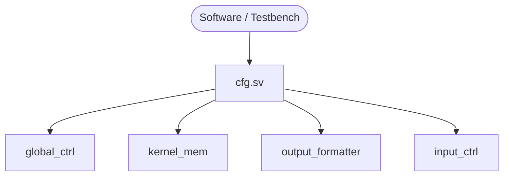

### Responsibilities / Non-Responsibilities

| Shall | Shall NOT |
|---|---|
| Store runtime configuration | Perform image processing |
| Provide stable values to other modules | Generate addresses |
| Hold configuration constant per execution | Store image/output pixels |
| Reset registers to predefined values | Control accelerator execution, generate windows, do arithmetic |

### Configuration Registers

| Register | Width | Reset | Description |
|---|---:|---:|---|
| `img_width` | 16 | 32 | Input image width (min supported: 32) |
| `img_height` | 16 | 32 | Input image height (min supported: 32) |
| `relu_en` | 1 | 0 | Enable ReLU block |
| `shift_amt` | 5 | 0 | Right shift amount (`output = input >>> shift_amt`, i.e. ÷2^shift_amt) |
| `round_en` | 1 | 0 | Enable rounding (used only when `shift_amt > 0`) |

**Reserved for future use:** `reserved_0`, `reserved_1`, `reserved_2` — do not affect behavior.

### Interface

**Inputs:** `clk`, `rst_n`. (Write interface: for v1, Testbench directly assigns values; future versions may use AXI-Lite / APB / Avalon / Wishbone / memory-mapped CPU without touching downstream RTL.)

**Outputs:**

| Signal | Width | Destination |
|---|---:|---|
| `img_width` | 16 | input_ctrl |
| `img_height` | 16 | input_ctrl |
| `relu_en` | 1 | relu |
| `shift_amt` | 5 | output_formatter |
| `round_en` | 1 | output_formatter |

### Reset Behavior
`img_width=32, img_height=32, relu_en=0, shift_amt=0, round_en=0` — a valid default configuration.

### Timing & Global-Controller Interaction

| Global state | Config register access |
|---|---|
| IDLE | Writable |
| PROCESSING | **Read-only** — must remain constant |
| DONE | Writable again for next execution |

### Design Rules
1. Only software/testbench may write registers — no RTL module may modify them
2. Every module treats config outputs as read-only
3. No temporary processing data may live in config registers
4. Config registers implement **no** control logic

### Verification Checklist
☐ Reset values correct ☐ Registers retain written values ☐ `relu_en` propagates ☐ `shift_amt` reaches formatter ☐ `round_en` reaches formatter ☐ Image dimensions propagate ☐ Configuration constant during processing ☐ Reset restores defaults

### RTL Notes
Synchronous register bank; one `always_ff` block; non-blocking assignments; no combinational logic beyond direct output assignment. Keep it purely sequential.

---

## 6. Module Specification: `dut_top.sv`

**Category:** Top-Level | **Instances:** 1

### Purpose
Integrates every RTL module — the only module visible externally. Instantiates all modules and connects all datapath/control/configuration signals. **Contains no processing logic.**

### Module Hierarchy

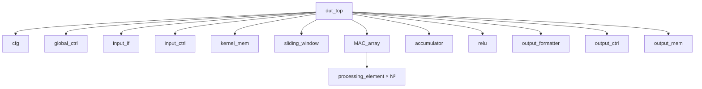

Only `processing_element.sv` is instantiated multiple times (N² instances, inside `MAC_array`); every other module has exactly one instance.

### External Interface

**Clock & Reset**

| Signal | Dir | Width | Description |
|---|---|---:|---|
| `clk` | in | 1 | System clock |
| `rst_n` | in | 1 | Active-low synchronous reset |

**Control**

| Signal | Dir | Width | Description |
|---|---|---:|---|
| `start` | in | 1 | Starts one execution |
| `done` | out | 1 | Asserted after finishing one output feature map |
| `busy` | out | 1 | Accelerator currently processing |

**Configuration** *(v1: direct testbench signals, no processor bus yet)*

| Signal | Dir | Width |
|---|---|---:|
| `cfg_img_width` | in | 16 |
| `cfg_img_height` | in | 16 |
| `cfg_relu_en` | in | 1 |
| `cfg_shift_amt` | in | 5 |
| `cfg_round_en` | in | 1 |

Future versions may replace this with AXI-Lite / APB / Wishbone / Avalon without changing the datapath.

**Kernel Loading**

| Signal | Dir | Width | Description |
|---|---|---:|---|
| `kernel_we` | in | 1 | Write enable |
| `kernel_addr` | in | ⌈log₂(N²)⌉ | Kernel coefficient address |
| `kernel_data` | in | 8 | Signed kernel coefficient |

**Input Image**

| Signal | Dir | Width | Description |
|---|---|---:|---|
| `pixel_in` | in | 8 | Unsigned grayscale pixel |
| `pixel_valid` | in | 1 | Input pixel valid |

Future versions may swap this for DMA / DDR / camera interface without touching the datapath.

**Output**

| Signal | Dir | Width | Description |
|---|---|---:|---|
| `pixel_out` | out | 16 | Final output pixel |
| `pixel_out_valid` | out | 1 | Output pixel valid |

### Internal Connectivity

| Source | Destination | Data |
|---|---|---|
| cfg | global_ctrl | Configuration |
| cfg | output_formatter | Shift / Rounding |
| cfg | relu | Enable |
| input_if | input_ctrl | Input pixels |
| input_ctrl | sliding_window | Pixel stream |
| sliding_window | MAC_array | N×N window |
| kernel_mem | MAC_array | Kernel coefficients |
| MAC_array | accumulator | Partial sum |
| accumulator | relu | Convolution result |
| relu | output_formatter | Activated result |
| output_formatter | output_ctrl | Output pixel |
| output_ctrl | output_mem | Output feature map |
| global_ctrl | input_ctrl / sliding_window / MAC_array / output_ctrl (etc.) | `processing_en` / status |

### Responsibilities / Non-Responsibilities

| Shall | Shall NOT |
|---|---|
| Instantiate all modules | Perform multiplication or accumulation |
| Connect all modules | Generate windows |
| Forward external inputs/outputs | Store kernel coefficients or pixels |
| | Implement an FSM or any combinational datapath logic |

*If a behavioral statement longer than a simple signal assignment appears in `dut_top.sv`, it should be flagged in code review.*

### Design Rules
1. Every datapath connection is point-to-point — no module reads another's internal signals
2. No module instantiates another except `MAC_array → processing_element`
3. All communication happens through explicit ports — no hidden dependencies
4. Every signal crossing a module boundary has exactly one driver

### Verification Checklist
☐ All modules instantiated ☐ Every config signal reaches its destination ☐ Input stream reaches Sliding Window ☐ Kernel reaches MAC Array ☐ Convolution result reaches ReLU ☐ Formatter reaches Output Controller ☐ Output Controller reaches Output Memory ☐ START/DONE/BUSY propagate correctly

### RTL Notes
`dut_top.sv` should be the simplest file in the project — a reader should understand the whole architecture just by opening it. Its purpose is readability and integration only.

---

## 7. Module Specification: `global_ctrl.sv`

**Category:** Controller | **Instances:** 1

### Purpose
The central control unit. Coordinates the complete execution flow by monitoring status and enabling processing stages. **Never manipulates image data** — control and synchronization only.

### Position in the Architecture
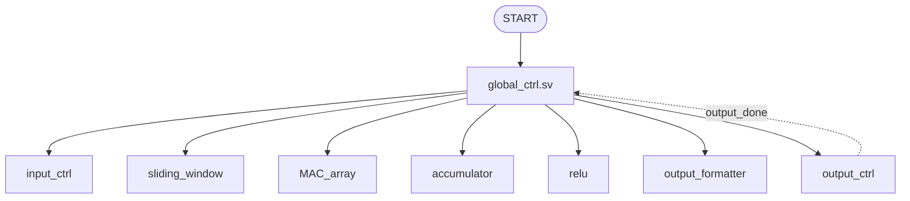

### Responsibilities / Non-Responsibilities

| Shall | Shall NOT |
|---|---|
| Wait for START | Receive image pixels |
| Start execution, hold processing state | Generate memory addresses / read kernel |
| Monitor completion, return to IDLE | Generate sliding windows |
| Generate `busy` | Perform arithmetic |
| Generate enable signals for downstream modules | Store data, apply ReLU, format output |

### Inputs

| Signal | Width | Description |
|---|---:|---|
| `clk` | 1 | System clock |
| `rst_n` | 1 | Active-low reset |
| `start` | 1 | Starts execution |
| `output_done` | 1 | Asserted by `output_ctrl` after the last output pixel |

### Outputs

| Signal | Width | Destination | Description |
|---|---:|---|---|
| `busy` | 1 | Top-Level | Accelerator busy flag |
| `done` | 1 | Top-Level | Execution completed (one-cycle pulse) |
| `processing_en` | 1 | Datapath | Enables processing |

> **Design decision:** rather than many individual enables (`input_en`, `mac_en`, `acc_en`...), v1 exports a single `processing_en`. Each processing module combines it with its own local valid signals — this greatly simplifies the control path. A `LOAD_CFG`-style extra pipeline stage was considered but is unnecessary for v1: config registers are assumed valid by the time `START` asserts, so `global_ctrl` needs only the three states below.

### FSM

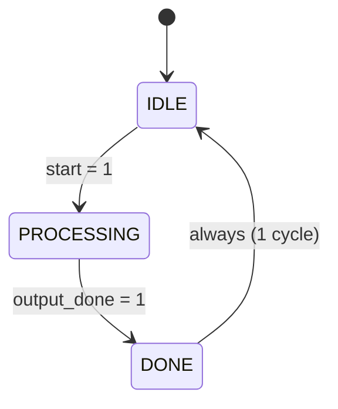

### State Description

| State | Outputs | Transition |
|---|---|---|
| **IDLE** | `busy=0, done=0, processing_en=0` | `start=1` → PROCESSING |
| **PROCESSING** | `busy=1, done=0, processing_en=1` | `output_done=1` → DONE |
| **DONE** | `busy=0, done=1, processing_en=0` (lasts exactly 1 clock cycle) | always → IDLE |

### Timing Diagram

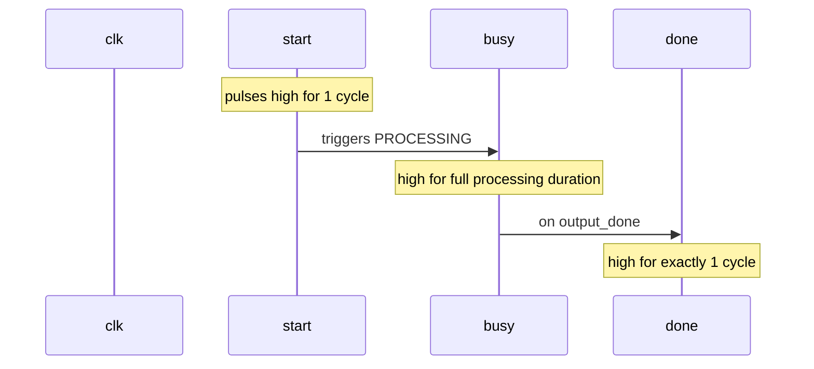

### State Transition Table

| Current State | Condition | Next State |
|---|---|---|
| IDLE | `start=0` | IDLE |
| IDLE | `start=1` | PROCESSING |
| PROCESSING | `output_done=0` | PROCESSING |
| PROCESSING | `output_done=1` | DONE |
| DONE | always | IDLE |

### Reset Behavior
`State=IDLE, busy=0, done=0, processing_en=0`. No processing begins automatically after reset.

### Interaction with Other Modules

| Module | Interaction |
|---|---|
| cfg | Reads configuration indirectly (via system integration) |
| input_ctrl / sliding_window / MAC_array / accumulator / relu / output_formatter | Enabled by `processing_en` |
| output_ctrl | Generates `output_done` |

### Corner Cases

| Case | Behavior |
|---|---|
| `START` asserted while `BUSY` | Ignored — current execution finishes first |
| `START` held high multiple cycles | Only the first rising edge initiates execution |
| Reset during PROCESSING | Immediately terminate, return to IDLE, discard partial image |

### Verification Checklist
☐ Reset enters IDLE ☐ START → PROCESSING ☐ BUSY only during PROCESSING ☐ DONE asserted for exactly 1 cycle ☐ DONE → IDLE ☐ START ignored while BUSY ☐ Reset interrupts PROCESSING correctly ☐ FSM never enters an illegal state

### RTL Implementation Notes
Enumerated FSM via `typedef enum logic`; one `always_ff` for the state register; one `always_comb` for next-state logic; one `always_comb` for Moore-style outputs.

```systemverilog
typedef enum logic [1:0] {
    IDLE,
    PROCESSING,
    DONE
} state_t;
```

### Future Extensions
The FSM is intentionally minimal for v1.0. Candidate future states: `LOAD_KERNEL`, `WAIT_FOR_INPUT`, `FLUSH_PIPELINE`, `ERROR`.

---

## 8. Module Specification: `input_if.sv`

**Category:** Interface | **Instances:** 1

### Purpose
Interfaces the accelerator with the external image source; converts the external protocol into the internal streaming protocol. Isolates the accelerator so that replacing the image source only requires modifying `input_if.sv`.

### Position in the Architecture
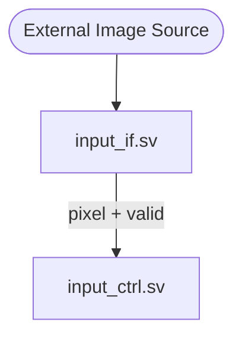

### Responsibilities / Non-Responsibilities

| Shall | Shall NOT |
|---|---|
| Receive external pixels | Count image rows/columns |
| Verify incoming pixels are valid | Store pixels or generate addresses |
| Forward pixels to input_ctrl | Generate sliding windows, perform convolution |
| Convert external → internal protocol | Control accelerator execution |

### Internal Streaming Protocol
All datapath modules use a simple `data` + `valid` handshake — **no READY signal**. If `valid == 0`, the receiver ignores `data`.

### Interface

| Signal | Width | Description |
|---|---:|---|
| `clk`, `rst_n` | 1 | Clock / active-low reset |
| `pixel_in` | 8 | Incoming grayscale pixel |
| `pixel_valid` | 1 | Incoming pixel valid |
| `processing_en` | 1 | Accelerator currently processing |
| `pixel_out` → input_ctrl | 8 | Forwarded pixel |
| `pixel_out_valid` → input_ctrl | 1 | Forwarded pixel valid |

### Functional Description
When `processing_en==1` **and** `pixel_valid==1`: `pixel_out = pixel_in`, `pixel_out_valid = 1`. Otherwise `pixel_out_valid = 0`. No other processing.

### Timing
Zero additional latency — behaves as a simple streaming pass-through.

### Reset Behavior
`pixel_out_valid = 0` (pixel value is don't-care while valid is low).

### Design Rules
1. Never buffers pixels
2. Never modifies pixel values — forwarded unchanged
3. Stays protocol-independent so future interfaces (AXI-Stream, camera, DDR, DMA...) only require changes here

### Future Extensions
AXI-Stream slave, camera receiver, DDR controller, DMA engine, FIFO buffering, clock-domain crossing — all excluded from v1.0.

### Verification Checklist
☐ Valid pixel forwarded correctly ☐ Invalid pixel not forwarded ☐ Pixel value unchanged ☐ Reset clears output valid ☐ No output while processing disabled ☐ Continuous streaming supported

### RTL Notes
One `always_ff` (if registering outputs) or continuous assignments (if combinational). Should be only a few lines of RTL — exists purely to decouple the datapath from external protocol changes.

---

## 9. Module Specification: `input_ctrl.sv`

**Category:** Controller | **Instances:** 1

### Purpose
Controls the flow of incoming pixels into the datapath and tracks the current row/column position within the image. Unlike `input_if`, this module understands image structure.

### Position in the Architecture
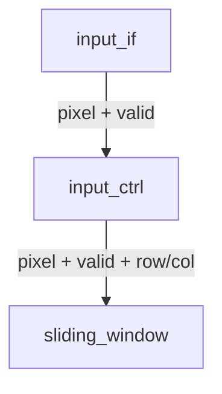

### Responsibilities / Non-Responsibilities

| Shall | Shall NOT |
|---|---|
| Accept pixels from input_if | Store image rows or the complete image |
| Track image position (row/col counters) | Generate sliding windows |
| Forward pixels to sliding_window | Perform convolution, apply ReLU, format output |
| Detect the last pixel of the image | Control accelerator execution |

### Interface

**Inputs:** `clk`, `rst_n`, `img_width[16]`, `img_height[16]` (from cfg), `processing_en`, `pixel_in[8]`, `pixel_valid`

**Outputs:**

| Signal | Width | Destination | Description |
|---|---:|---|---|
| `pixel_out` | 8 | sliding_window | Forwarded pixel |
| `pixel_out_valid` | 1 | sliding_window | Pixel valid |
| `row_idx` | 16 | sliding_window | Current image row |
| `col_idx` | 16 | sliding_window | Current image column |
| `image_done` | 1 | global_ctrl (future use) | Last input pixel received |

**Internal registers:** `row_cnt[16]`, `col_cnt[16]`

### Functional Description
When `processing_en==1` and `pixel_valid==1`: forward the pixel, assert `pixel_out_valid`, update counters.

- **Column counter:** increments each valid pixel; when `col_cnt == img_width-1` → `col_cnt=0, row_cnt++`
- **Row counter:** when `row_cnt == img_height-1 AND col_cnt == img_width-1`, the final image pixel has arrived → assert `image_done` for one cycle

### Reset Behavior
`row_cnt=0, col_cnt=0, pixel_out_valid=0, image_done=0`

### Design Rules
1. Never buffers image rows
2. Never modifies pixel values
3. Image dimensions always come from `cfg.sv` — never hardcoded
4. Counters advance **only** on valid pixels; invalid cycles never affect position

### Corner Cases

| Case | Behavior |
|---|---|
| Image width/height = 32 (minimum) | Counters wrap correctly, last pixel detected correctly |
| `pixel_valid == 0` | Counters unchanged, no output |
| Reset during reception | Reception aborted, counters return to zero, next image starts at (0,0) |

### Verification Checklist
☐ Pixel forwarded correctly ☐ Row/column counters increment and wrap correctly ☐ Last pixel detected ☐ Invalid cycles ignored ☐ Reset clears counters ☐ Image dimensions respected

### RTL Notes
One sequential process for counters; simple combinational/continuous forwarding logic. Lightweight and deterministic.

### Future Extensions
Multi-channel support, ROI processing, programmable scan order, image cropping, frame sync — excluded from v1.0.

---

## 10. Module Specification: `kernel_mem.sv`

**Category:** Memory (Configuration Path) | **Instances:** 1

### Purpose
Stores the programmable convolution kernel coefficients. Loaded before execution, held **read-only** during processing.

### Position in the Architecture
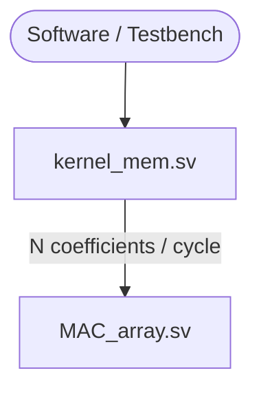

### Responsibilities / Non-Responsibilities

| Shall | Shall NOT |
|---|---|
| Store all kernel coefficients | Modify coefficients |
| Allow software/testbench to program them | Perform multiplication or convolution |
| Provide coefficients to MAC Array | Generate addresses, apply activation, format outputs, control execution |
| Hold coefficients constant during processing | |

### Kernel Organization
Stored as a 1D memory: `Address = row × N + column`. Example for N=5, K00..K44 map to addresses 0..24.

### Interface

| Signal | Width | Description |
|---|---:|---|
| `clk`, `rst_n` | 1 | Clock / reset |
| `kernel_we` | 1 | Write enable |
| `kernel_addr` | ⌈log₂(N²)⌉ | Write address |
| `kernel_data` | 8 | Signed coefficient |
| `processing_en` | 1 | Accelerator processing (read context) |
| `kernel_coeff[N][N]` (out) | 8 each | → MAC Array |

**Recommended storage:** `logic signed [7:0] mem [0:N*N-1];`

### Functional Description
**Programming phase** (idle only): `kernel_we==1` → `mem[kernel_addr] <= kernel_data`.
**Processing phase:** all N² coefficients are continuously provided to the MAC Array simultaneously (no repeated memory accesses — maximizes throughput).

### Reset Behavior
Kernel contents are **undefined** after reset. The kernel must always be programmed by software/testbench before `START`; the accelerator never assumes a default kernel.

### Design Rules
1. Coefficients never change during processing
2. Only software/testbench may program the kernel
3. No arithmetic is ever performed here
4. Coefficients are stored as signed 8-bit integers

### Corner Cases

| Case | Behavior |
|---|---|
| Programming while PROCESSING | Not supported — undefined behavior; software must not write during processing |
| Invalid address | Software must only access valid addresses (0…N²−1) |

### Verification Checklist
☐ All coefficients programmed correctly ☐ Signed values correct ☐ First/last coefficient read correctly ☐ Negative coefficients handled ☐ Kernel constant during processing ☐ Reset behavior verified

### RTL Notes
Register array, one sequential write process, continuous read outputs. Since N² is tiny (e.g. 25 bytes for N=5), synthesis will likely use distributed RAM/registers rather than BRAM — this is acceptable and can even **improve** the Figure of Merit by avoiding unnecessary BRAM.

### Design Rationale
Only N² bytes to store (25 bytes for N=5) — using BRAM would waste FPGA resources. Registers/distributed RAM let all coefficients be available to the MAC Array every cycle.

---

## 11. Module Specification: `sliding_window.sv`

**Category:** Datapath | **Instances:** 1

### Purpose
Generates one valid N×N convolution window from the incoming pixel stream, combining **Line Buffers** and a **Window Generator** into a single module. Maximizes data reuse and minimizes memory bandwidth.

### Position in the Architecture
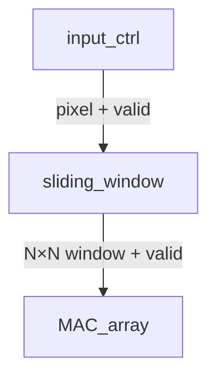

### Responsibilities / Non-Responsibilities

| Shall | Shall NOT |
|---|---|
| Receive the input pixel stream | Count image dimensions |
| Store the previous N−1 rows | Perform multiplication or accumulation |
| Shift pixels horizontally | Store the complete image |
| Construct one valid N×N window | Apply activation, format output, control execution |
| Assert `window_valid` only for complete windows | |

### Design Philosophy — Data Reuse

Instead of re-reading overlapping pixels, previously received pixels are reused. For N=3 on a 5-column image:

```mermaid
flowchart LR
    subgraph Window1["Window 1 (9 reads)"]
    direction LR
    A1[A] --- B1[B] --- C1[C]
    end
    subgraph Window2["Window 2 (only 3 new reads)"]
    direction LR
    B2[B] --- C2[C] --- D2[D]
    end
    Window1 -.6 pixels reused.-> Window2
```

### Internal Architecture

```mermaid
flowchart TD
    IN([Incoming Pixels]) --> LB[Line Buffers<br/>stores previous N−1 rows]
    LB --> WG[Window Generator<br/>N×N sliding register matrix]
    WG --> OUT([N×N Window])
```

- **Line Buffers:** store `(N−1) × Image Width` pixels. Example: N=5, width=32 → 4×32 = 128 pixels.
- **Window Generator:** on every new pixel, shifts the window horizontally, inserts the newest pixel, and updates all rows using the line-buffer outputs.

### Interface

| Signal | Width | Description |
|---|---:|---|
| `clk`, `rst_n` | 1 | Clock / reset |
| `pixel_in` | 8 | Input pixel |
| `pixel_valid` | 1 | Pixel valid |
| `end_of_row` | 1 | Asserted on last pixel of each row |
| `end_of_frame` | 1 | Asserted on last pixel of the image |
| `window[N*N]` (out) | 8 each | → MAC_array, flat array `logic [7:0] window [0:N*N-1]` |
| `window_valid` (out) | 1 | → MAC_array |

**Recommended storage:** `line_buffer[0:N-2][0:IMG_WIDTH-1]`, `window_reg[0:N*N-1]`.

### Startup & Steady-State Behavior

- **Startup:** No valid window exists until the line buffers and the full window register are filled. Only then does `window_valid = 1`.
- **Steady-state:** After fill, every accepted pixel advances the window by exactly one column — one pixel in, one updated window out.

### Reset Behavior
All line buffers and window registers cleared; `window_valid = 0`. Next image starts from an empty state.

### Design Rules
1. Only the previous N−1 rows may be stored — never the complete image
2. Pixels are never fetched twice from the external source
3. Window advances by exactly one column per accepted pixel
4. `window_valid` asserted only when every window element holds valid image data

### Corner Cases

| Case | Behavior |
|---|---|
| Startup | `window_valid` stays low until first complete window is assembled |
| End of row | Row transition handled without corrupting line-buffer contents |
| End of frame | No additional windows generated after the last pixel |
| Reset during processing | Immediately clears all storage, invalidates the current window |

### Verification Checklist
☐ Line buffers store previous rows correctly ☐ Window shifts correctly ☐ First valid window at correct time ☐ Every window contains correct pixels ☐ `window_valid` correct ☐ Horizontal sliding & row transitions verified ☐ Reset clears storage

### RTL Notes
Line buffers via BRAM/inferred RAM when appropriate; window registers via flip-flops; sequential storage updates; combinational window outputs. Target: one window update per clock after pipeline fill.

### Design Rationale
Retaining only N−1 rows plus a sliding window register matrix means each pixel is fetched exactly once — minimizing memory bandwidth, reducing MAC Array idle cycles, achieving continuous streaming, and improving Figure of Merit without buffering the whole image.

---

## 12. Module Specification: `processing_element.sv`

**Category:** Datapath | **Instances:** N² (inside `MAC_array`)

### Purpose
Performs one signed multiplication between one image pixel and one kernel coefficient — the smallest computational unit. The MAC Array is built from many identical PEs.

### Position in the Architecture
```mermaid
flowchart TD
    P([Window Pixel]) --> PE[Processing Element]
    K([Kernel Coefficient]) --> PE
    PE --> PR([Signed Product])
```

### Responsibilities / Non-Responsibilities

| Shall | Shall NOT |
|---|---|
| Receive one pixel and one coefficient | Perform accumulation |
| Multiply the two values | Store pixels or coefficients |
| Produce one signed product | Generate windows, apply activation, format output, control execution |

### Data Types

| Signal | Width | Type | Range |
|---|---:|---|---|
| `pixel` | 8 | Unsigned | 0 … 255 |
| `coeff` | 8 | Signed | −128 … 127 |
| `product` | 16 | Signed | −32640 … 32385 (both fit in signed 16-bit) |

### Interface

| Signal | Width | Description |
|---|---:|---|
| `pixel` | 8 | Unsigned image pixel |
| `coeff` | 8 | Signed kernel coefficient |
| `valid_in` | 1 | Input valid |
| `product` (out) | 16 | Signed multiplication result |
| `valid_out` (out) | 1 | Product valid |

### Functional Description
`valid_in=1` → `product = pixel × coeff`, `valid_out=1`. Otherwise `valid_out=0` (product ignored).

### Signed Arithmetic
Since pixel is unsigned and coeff is signed, mixed-sign multiplication must be explicit:
```systemverilog
logic [7:0]         pixel;
logic signed [7:0]  coeff;
logic signed [15:0] product;
assign product = $signed({1'b0, pixel}) * coeff;
```

### DSP Inference / Pipelining
Written to let synthesis infer a dedicated DSP block — no vendor-specific primitives. v1.0 is a **combinational** multiplier (input→multiply→output within one cycle). An optional pipeline register may be added in a future revision if timing becomes critical.

### Reset Behavior
No internal state — reset does not affect the multiply logic. Only `valid_out` is invalid while `valid_in` is low.

### Design Rules
1. Exactly one multiplication per PE
2. No accumulation inside the PE
3. No storage elements unless explicitly pipelining
4. The multiplier stays generic and synthesizable

### Corner Cases

| Input | Output |
|---|---|
| pixel = 0 | 0 |
| coeff = 0 | 0 |
| Negative coeff | Negative output |
| Max positive: 255 × 127 | 32385 |
| Max negative: 255 × (−128) | −32640 |

### Verification Checklist
☐ Positive×Positive ☐ Positive×Negative ☐ Zero×Positive ☐ Zero×Negative ☐ Max positive product ☐ Max negative product ☐ Random vectors ☐ Correct valid propagation

### RTL Notes
Pure combinational logic, continuous assignment, explicit signed casting, no clocked logic, no vendor primitives. Keep it extremely small and readable.

### Design Rationale
Separating multiply from accumulate gives: simple reusable RTL, easy unit verification, scalable MAC Array construction, clear responsibility separation, and flexibility for future pipelining/resource sharing.

---

## 13. Module Specification: `MAC_array.sv`

**Category:** Datapath | **Instances:** 1

### Purpose
First reduction stage of convolution. Receives a complete N×N window and N×N kernel and computes **N row partial sums** (does **not** compute the final convolution result — that's the Accumulator's job).

### Internal Architecture

```mermaid
flowchart TD
    W([N×N Window Pixels]) --> PEA["N² Processing Elements"]
    K([Kernel Memory]) --> PEA
    PEA -->|N² products, 16-bit each| RA["N Parallel Row Adders"]
    RA -->|N partial sums| ACC[accumulator.sv]
```

Example for N=5 — Processing Element grid:

| | Col 0 | Col 1 | Col 2 | Col 3 | Col 4 |
|---|---|---|---|---|---|
| Row 0 | PE00 | PE01 | PE02 | PE03 | PE04 |
| Row 1 | PE10 | PE11 | PE12 | PE13 | PE14 |
| Row 2 | PE20 | PE21 | PE22 | PE23 | PE24 |
| Row 3 | PE30 | PE31 | PE32 | PE33 | PE34 |
| Row 4 | PE40 | PE41 | PE42 | PE43 | PE44 |

Each PE computes `pixel × coefficient` independently and **all PEs operate simultaneously**. Each row is reduced independently (`RowSum0 = P00+P01+P02+P03+P04`, etc.) rather than summing all N² products at once — these row sums go to the Accumulator.

### Responsibilities / Non-Responsibilities

| Shall | Shall NOT |
|---|---|
| Receive one window + one kernel | Produce the final convolution result |
| Instantiate N² Processing Elements | Apply ReLU or format outputs |
| Compute one multiplication per PE | Store image data or kernel coefficients |
| Compute N row partial sums | Generate sliding windows, control execution |
| Forward partial sums to Accumulator | |

### Interface

| Signal | Width | Description |
|---|---:|---|
| `window[N²]` | 8 each | Window pixels |
| `kernel_coeffs[N²]` | 8 each | Signed kernel coefficients |
| `window_valid` | 1 | Window valid |
| `partial_sum[N]` (out) | signed | One partial sum per kernel row |
| `partial_valid` (out) | 1 | Partial sums valid |

### Partial Sum Width
Each product is signed 16-bit; a row sums N of them. Recommended width: `16 + ⌈log₂(N)⌉`.

| N | Recommended Width |
|---:|---:|
| 3 | 18 bits |
| 5 | 19 bits |
| 7 | 19 bits |

### Functional Description
On `window_valid=1`: feed each pixel/coefficient pair to its PE → collect products → reduce each row independently → assert `partial_valid`. One set of partial sums is produced per valid input window.

### Reset Behavior
No architectural state; after reset `partial_valid = 0` (outputs ignored until asserted).

### Design Rules
1. One PE per kernel coefficient
2. All PEs operate in parallel
3. MAC Array never computes the final convolution sum
4. Each row is reduced independently, and all row adders run in parallel

### Corner Cases

| Case | Behavior |
|---|---|
| Zero window / zero kernel | All partial sums = 0 |
| Negative coefficients | Signed arithmetic preserved through the reduction tree |
| Mixed-sign products | No overflow within the chosen partial-sum width |

### Verification Checklist
☐ All PEs instantiated ☐ Window/kernel correctly mapped to PEs ☐ Row reductions verified ☐ Signed arithmetic verified ☐ Zero kernel/image verified ☐ Random convolution vectors ☐ Valid signal propagation

### RTL Notes
Generate loop for PEs, generate loop for row adders, balanced adder trees per row:
```systemverilog
for (genvar r = 0; r < N; r++) begin ... end
```

### Design Rationale & Resource Considerations
Splitting into row-reduction (here) + final accumulation (next module) yields shallower combinational logic, better Fmax, clearer responsibilities, simpler RTL, and easier verification — scaling naturally as N grows.

| Resource | Quantity |
|---|---:|
| Processing Elements | N² |
| DSP Blocks (expected) | N² |
| Row Adders | N |
| Final Accumulator | 1 |

---

## 14. Module Specification: `accumulator.sv`

**Category:** Datapath | **Instances:** 1

### Purpose
Final arithmetic stage — sums the N row partial sums from the MAC Array into the final convolution result. Performs **addition only**.

### Position in the Architecture
```mermaid
flowchart TD
    MAC[MAC_array] -->|N row partial sums| ACC[accumulator.sv]
    ACC -->|Final convolution result| RELU[relu.sv]
```

### Responsibilities / Non-Responsibilities

| Shall | Shall NOT |
|---|---|
| Receive all row partial sums | Perform multiplication |
| Compute the final convolution sum | Read kernel coefficients |
| Preserve signed arithmetic | Store pixels, generate windows |
| Forward result to ReLU | Apply ReLU, format output, control execution |

### Interface

| Signal | Width | Description |
|---|---:|---|
| `partial_sum[N]` | `PARTIAL_W` | Row partial sums |
| `partial_valid` | 1 | Partial sums valid |
| `conv_result` (out) | `ACC_W` | Final convolution result |
| `conv_valid` (out) | 1 | Result valid |

### Arithmetic Operation
`conv_result = RowSum0 + RowSum1 + ... + RowSum(N-1)` — no multiplication.

### Output Width
`ACC_W = PARTIAL_W + ⌈log₂(N)⌉` (exact width defined in the shared package).

| N | PARTIAL_W | ACC_W |
|---:|---:|---:|
| 3 | 18 | 20 |
| 5 | 19 | 22 |
| 7 | 19 | 22 |

### Functional Description
`partial_valid=1` → read all row sums, compute final sum, assert `conv_valid=1`. Otherwise `conv_valid=0`.

### Reset Behavior
No architectural state; `conv_valid = 0` after reset (result ignored while invalid).

### Design Rules
1. Addition only
2. Signed arithmetic preserved throughout
3. **No** saturation, clipping, truncation, or rounding here — that belongs exclusively to `output_formatter.sv`
4. One result per valid window

### Verification Checklist
☐ Correct addition of all row sums ☐ Signed arithmetic verified ☐ Positive-only / negative-only / mixed-sign vectors ☐ Zero vector ☐ Random vectors ☐ `conv_valid` propagation

### RTL Notes
Pure combinational reduction, balanced adder tree preferred over a linear chain, no registers unless pipelining is added later.

### Design Rationale & Resource Considerations
Three-stage split (multiply → row-reduce → final-accumulate) yields shorter critical paths, better scalability, simpler RTL, and easier verification. Consumes LUT-based adders only — **no DSP, no BRAM** — negligible FoM impact.

---

## 15. Module Specification: `relu.sv`

**Category:** Datapath (post-processing) | **Instances:** 1

### Purpose
Implements the Rectified Linear Unit activation. Receives the signed convolution result and optionally suppresses negative values, gated by `cfg.relu_en`.

### Position in the Architecture
```mermaid
flowchart TD
    ACC[accumulator] -->|Convolution result| RELU[relu.sv]
    RELU -->|Activated result| FMT[output_formatter.sv]
```

### Responsibilities / Non-Responsibilities

| Shall | Shall NOT |
|---|---|
| Receive the convolution result | Perform convolution, multiplication, or accumulation |
| Check its sign | Perform scaling, rounding, saturation, or clipping |
| Zero out negatives when enabled | Store any data |
| Pass positives through unchanged | |
| Support runtime enable/disable | |

### Mathematical Operation

$$
\text{Enabled: } output = \begin{cases} input, & input \ge 0 \\ 0, & input < 0 \end{cases}
\qquad
\text{Disabled: } output = input
$$

### Interface

| Signal | Width | Description |
|---|---:|---|
| `conv_result` | `ACC_W` | Signed convolution result |
| `conv_valid` | 1 | Input valid |
| `relu_en` | 1 | Runtime enable |
| `relu_result` (out) | `ACC_W` | Output after activation |
| `relu_valid` (out) | 1 | Output valid |

### Functional Description
`conv_valid=1` → if `relu_en=0`: pass through unchanged. If `relu_en=1`: `conv_result<0 → 0`, else pass through.

### Reset Behavior
No internal state; `relu_valid = 0` after reset.

### Design Rules
1. Only negative values may be modified
2. Positive values pass through unchanged
3. Zero stays zero
4. When disabled, behaves as a direct wire

### Verification Checklist
☐ Positive input passes unchanged ☐ Negative input → 0 ☐ Zero stays zero ☐ Disabled bypasses correctly ☐ Valid propagation ☐ Random signed vectors

### RTL Notes
```systemverilog
if (!relu_en)
    relu_result = conv_result;
else if (conv_result < 0)
    relu_result = '0;
else
    relu_result = conv_result;
```
Purely combinational — no registers required.

### Design Rationale & Resource Considerations
Kept as a separate module (rather than merged into the formatter) to explicitly demonstrate the optional competition feature, improve modularity, simplify unit verification, and allow future swap-in of Leaky ReLU / ReLU6 / PReLU without touching the formatter. Cost: one signed comparison + one mux → **0 DSPs, 0 BRAMs, very low LUTs, 0 FFs** — negligible FoM impact.

---

## 16. Module Specification: `output_formatter.sv`

**Category:** Datapath (post-processing) | **Instances:** 1

### Purpose
Converts the raw convolution result into the final output pixel format. Owns **all** numerical post-processing after convolution — performs no convolution arithmetic itself.

### Position in the Architecture
```mermaid
flowchart TD
    ACC[accumulator] --> RELU[relu.sv]
    RELU --> FMT[output_formatter.sv]
    FMT --> OCTRL[output_ctrl.sv]
```

### Processing Pipeline

```mermaid
flowchart LR
    IN([Input]) --> SH[Arithmetic Right Shift]
    SH --> RND[Optional Rounding]
    RND --> SAT[Saturation]
    SAT --> OUT([16-bit Signed Output])
```

### Responsibilities / Non-Responsibilities

| Shall | Shall NOT |
|---|---|
| Scale the convolution result | Perform multiplication or accumulation |
| Optionally round the scaled value | Perform ReLU |
| Saturate out-of-range values | Store output pixels |
| Produce the final output precision | Generate memory addresses, control execution |
| Forward the formatted pixel | |

### Interface

| Signal | Width | Description |
|---|---:|---|
| `relu_result` | `ACC_W` | Signed convolution result |
| `relu_valid` | 1 | Input valid |
| `shamt` | 5 | Runtime scaling factor |
| `round_en` | 1 | Enable rounding |
| `pixel_out` (out) | 16 | Final formatted output |
| `pixel_valid` (out) | 1 | Output valid |

### Stage 1 — Scaling
`scaled = relu_result >>> shamt;` (arithmetic shift preserves sign; `shamt` comes from `cfg.sv`).

### Stage 2 — Optional Rounding
`round_en=0` → `rounded = scaled`. `round_en=1` → round to nearest before the shift, e.g. `rounded = scaled + (1 << (shamt-1))` prior to shifting. *(Exact RTL may differ as long as the rounding policy's numerical behavior matches.)*

### Stage 3 — Saturation
16-bit signed range: **max = +32767, min = −32768**.
- `rounded > 32767` → `pixel_out = 32767`
- `rounded < −32768` → `pixel_out = −32768`
- otherwise → `pixel_out = rounded`

### Functional Description
`relu_valid=1` → scale → round (optional) → saturate → assert `pixel_valid=1`. Otherwise `pixel_valid=0`.

### Reset Behavior
No architectural state; `pixel_valid = 0` after reset.

### Design Rules
1. Scaling always occurs before saturation
2. Rounding is optional, controlled by `round_en`
3. Sign is never modified incorrectly
4. Output is always signed 16-bit

### Corner Cases

| Case | Behavior |
|---|---|
| `shamt = 0` | Input passes unchanged to rounding stage |
| Max positive overflow | Saturates to 32767 |
| Max negative overflow | Saturates to −32768 |
| Rounding disabled/enabled | Scaling with/without the rounding step, per policy |

### Verification Checklist
☐ No scaling ☐ Various shift amounts ☐ Positive/negative overflow ☐ Rounding disabled/enabled ☐ Positive/negative/zero values ☐ Random signed vectors

### RTL Notes
Pure combinational logic; arithmetic shift operator `>>>`; signed comparisons for saturation; runtime-configurable shift amount. No registers required.

### Design Rationale & Resource Considerations
Isolating formatting from the convolution datapath simplifies the arithmetic modules, eases experimentation with scaling factors, allows runtime-adjustable output precision, and enables independent verification — directly addressing the competition's overflow/truncation/saturation/rounding requirements. Cost: **0 DSPs, 0 BRAMs, low LUTs, 0 FFs**.

---

## 17. Module Specification: `output_ctrl.sv`

**Category:** Controller | **Instances:** 1

### Purpose
Manages transmission of the output feature map. Receives formatted pixels, tracks output image position, forwards pixels externally, and detects/reports completion to the Global Controller.

### Position in the Architecture
```mermaid
flowchart TD
    FMT[output_formatter] -->|pixel + valid + pixel_last| OCTRL[output_ctrl.sv]
    OCTRL --> EXT([External Output Interface])
    OCTRL -.done.-> GC[global_ctrl]
```

### Responsibilities / Non-Responsibilities

| Shall | Shall NOT |
|---|---|
| Receive formatted output pixels | Perform convolution or arithmetic |
| Stream pixels externally | Store the complete output feature map |
| Count output rows/columns | Apply ReLU, scaling, or saturation |
| Detect feature-map completion | Control other datapath modules |
| Notify Global Controller of completion | |

### Interface

**Inputs:** `clk`, `rst_n`, `out_width[16]`, `out_height[16]` (config), `pixel_in[16]`, `pixel_valid`, `pixel_last`

**Outputs:**

| Signal | Width | Destination |
|---|---:|---|
| `pixel_out` | 16 | External interface |
| `pixel_out_valid` | 1 | External interface |
| `done` | 1 | global_ctrl |

**Internal registers:** `row_cnt[16]`, `col_cnt[16]`

### Functional Description
`pixel_valid=1` → forward pixel, assert `pixel_out_valid`, update counters.

- **Column counter:** increments per valid pixel; `col_cnt == out_width-1` → `col_cnt=0, row_cnt++`
- **Row counter:** `row_cnt == out_height-1 AND col_cnt == out_width-1` → final pixel transmitted

### Completion Detection
When `pixel_last = 1` (from `output_formatter`), assert `done = 1` for one clock cycle, then return to idle.

### Reset Behavior
`row_cnt=0, col_cnt=0, pixel_out_valid=0, done=0`

### Design Rules
1. Output pixels are never modified
2. Only transmits when `pixel_valid` is asserted
3. Counters advance only on valid output pixels
4. `done` is asserted exactly once per processed image

### Corner Cases

| Case | Behavior |
|---|---|
| `pixel_valid = 0` | Counters held, no output |
| Reset during transmission | Transmission aborted, counters return to zero, next image starts fresh |
| Last output pixel | `done = 1` for exactly one clock cycle |

### Verification Checklist
☐ Pixels forwarded correctly ☐ Row/column counters verified ☐ Invalid cycles ignored ☐ Last pixel detected ☐ Done pulse verified ☐ Reset behavior verified

### RTL Notes
One sequential process for counters, continuous assignments for forwarded data, single-cycle `done` pulse generation. Keep it lightweight.

### Design Rationale & Resource Considerations
Separating output-stream management from numerical processing allows the output protocol to change without touching arithmetic modules, independent verification of sequencing, and a cleaner top level. Cost: very low LUTs, FFs for counters, **0 DSPs, 0 BRAMs** — negligible FoM impact.

---

## 18. Final Frozen File List & Summary

### 18.1 Complete RTL File Set

```
dut_top.sv
cfg.sv
global_ctrl.sv
input_if.sv
input_ctrl.sv
kernel_mem.sv
sliding_window.sv
processing_element.sv
MAC_array.sv
accumulator.sv
relu.sv
output_formatter.sv
output_ctrl.sv
```

Plus one shared package — **not** a DUT module:

```
accelerator_pkg.sv
```
containing common typedefs, width calculations, shared parameters, and utility functions.

### 18.2 Final Architecture Summary

```mermaid
flowchart TD
    CFG[Configuration Registers] --> GC[Global Controller]
    GC --> IIF[Input Interface]
    IIF --> ICTRL[Input Controller]
    ICTRL --> SW[Sliding Window]
    SW --> MAC[MAC Array]
    MAC --> ACC[Accumulator]
    ACC --> RELU["ReLU (Optional)"]
    RELU --> FMT[Output Formatter]
    FMT --> OCTRL[Output Controller]
    OCTRL --> OUT[Output Feature Map]
```

### 18.3 Project Status

**Architecture Status: Frozen**

The project is ready for:

1. RTL implementation
2. Verification plan development
3. SystemVerilog coding
4. Python golden model development
5. Module-level verification
6. Top-level integration
7. FPGA synthesis and implementation

---
### End of Specification
